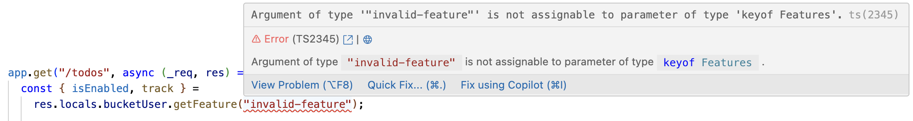
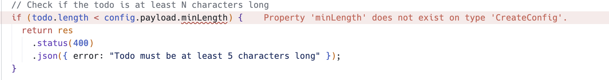

# Bucket Node.js SDK

Node.js, JavaScript/TypeScript client for [Bucket.co](https://bucket.co).

Bucket supports feature toggling, tracking feature usage, collecting feedback on features, and [remotely configuring features](#remote-config-beta).

## Installation

Install using your favourite package manager:



```sh
npm i @bucketco/node-sdk
```



```sh
yarn add @bucketco/node-sdk
```



```sh
bun add @bucketco/node-sdk
```



```sh
pnpm add @bucketco/node-sdk
```



```sh
deno add npm:@bucketco/node-sdk
```



Other supported languages/frameworks are in the [Supported languages](https://docs.bucket.co/quickstart/supported-languages) documentation pages.

You can also [use the HTTP API directly](https://docs.bucket.co/api/http-api)

## Basic usage

To get started you need to obtain your secret key from the [environment settings](https://app.bucket.co/envs/current/settings/app-environments)
in Bucket.

> [!CAUTION]
> Secret keys are meant for use in server side SDKs only. Secret keys offer the users the ability to obtain
> information that is often sensitive and thus should not be used in client-side applications.

Bucket will load settings through the various environment variables automatically (see [Configuring](#configuring) below).

1. Find the Bucket secret key for your development environment under [environment settings](https://app.bucket.co/envs/current/settings/app-environments) in Bucket.
2. Set `BUCKET_SECRET_KEY` in your `.env` file
3. Create a `bucket.ts` file containing the following:

```typescript
import { BucketClient } from "@bucketco/node-sdk";

// Create a new instance of the client with the secret key. Additional options
// are available, such as supplying a logger and other custom properties.
//
// We recommend that only one global instance of `client` should be created
// to avoid multiple round-trips to our servers.
export const bucketClient = new BucketClient();

// Initialize the client and begin fetching feature targeting definitions.
// You must call this method prior to any calls to `getFeatures()`,
// otherwise an empty object will be returned.
bucketClient.initialize().then({
  console.log("Bucket initialized!")
})
```

Once the client is initialized, you can obtain features along with the `isEnabled`
status to indicate whether the feature is targeted for this user/company:

> [!IMPORTANT]
> If `user.id` or `company.id` is not given, the whole `user` or `company` object is ignored.

```typescript
// configure the client
const boundClient = bucketClient.bindClient({
  user: {
    id: "john_doe",
    name: "John Doe",
    email: "john@acme.com",
    avatar: "https://example.com/users/jdoe",
  },
  company: {
    id: "acme_inc",
    name: "Acme, Inc.",
    avatar: "https://example.com/companies/acme",
  },
});

// get the huddle feature using company, user and custom context to
// evaluate the targeting.
const { isEnabled, track, config } = boundClient.getFeature("huddle");

if (isEnabled) {
  // this is your feature gated code ...
  // send an event when the feature is used:
  track();

  if (config?.key === "zoom") {
    // this code will run if a given remote configuration
    // is set up.
  }

  // CAUTION: if you plan to use the event for automated feedback surveys
  // call `flush` immediately after `track`. It can optionally be awaited
  // to guarantee the sent happened.
  boundClient.flush();
}
```

You can also use the `getFeatures()` method which returns a map of all features:

```typescript
// get the current features (uses company, user and custom context to
// evaluate the features).
const features = boundClient.getFeatures();
const bothEnabled =
  features.huddle?.isEnabled && features.voiceHuddle?.isEnabled;
```

## High performance feature targeting

The SDK contacts the Bucket servers when you call `initialize()`
and downloads the features with their targeting rules.
These rules are then matched against the user/company information you provide
to `getFeatures()` (or through `bindClient(..).getFeatures()`). That means the
`getFeatures()` call does not need to contact the Bucket servers once
`initialize()` has completed. `BucketClient` will continue to periodically
download the targeting rules from the Bucket servers in the background.

### Batch Operations

The SDK automatically batches operations like user/company updates and feature tracking events to minimize API calls.
The batch buffer is configurable through the client options:

```typescript
const client = new BucketClient({
  batchOptions: {
    maxSize: 100, // Maximum number of events to batch
    intervalMs: 1000, // Flush interval in milliseconds
  },
});
```

You can manually flush the batch buffer at any time:

```typescript
await client.flush();
```

> [!TIP]
> It's recommended to call `flush()` before your application shuts down to ensure all events are sent.

### Rate Limiting

The SDK includes automatic rate limiting for feature events to prevent overwhelming the API.
Rate limiting is applied per unique combination of feature key and context. The rate limiter window size is configurable:

```typescript
const client = new BucketClient({
  rateLimiterOptions: {
    windowSizeMs: 60000, // Rate limiting window size in milliseconds
  },
});
```

### Feature definitions

Feature definitions include the rules needed to determine which features should be enabled and which config values should be applied to any given user/company.
Feature definitions are automatically fetched when calling `initialize()`.
They are then cached and refreshed in the background.
It's also possible to get the currently in use feature definitions:

```typescript
import fs from "fs";

const client = new BucketClient();

const featureDefs = await client.getFeatureDefinitions();
// [{
//   key: "huddle",
//   description: "Live voice conversations with colleagues."
//   flag: { ... }
//   config: { ... }
// }]
```

## Error Handling

The SDK is designed to fail gracefully and never throw exceptions to the caller. Instead, it logs errors and provides
fallback behavior:

1. **Feature Evaluation Failures**:

   ```typescript
   const { isEnabled } = client.getFeature("my-feature");
   // If feature evaluation fails, isEnabled will be false
   ```

2. **Network Errors**:

   ```typescript
   // Network errors during tracking are logged but don't affect your application
   const { track } = client.getFeature("my-feature");
   if (isEnabled) {
     try {
       await track();
     } catch (error) {
       // The SDK already logged this error
       // Your application can continue normally
     }
   }
   ```

3. **Missing Context**:

   ```typescript
   // The SDK tracks missing context fields but continues operation
   const features = client.getFeatures({
     user: { id: "user123" },
     // Missing company context will be logged but won't cause errors
   });
   ```

4. **Offline Mode**:

   ```typescript
   // In offline mode, the SDK uses feature overrides
   const client = new BucketClient({
     offline: true,
     featureOverrides: () => ({
       "my-feature": true,
     }),
   });
   ```

The SDK logs all errors with appropriate severity levels. You can customize logging by providing your own logger:

```typescript
const client = new BucketClient({
  logger: {
    debug: (msg) => console.debug(msg),
    info: (msg) => console.info(msg),
    warn: (msg) => console.warn(msg),
    error: (msg, error) => {
      console.error(msg, error);
      // Send to your error tracking service
      errorTracker.capture(error);
    },
  },
});
```

## Remote config (beta)

Remote config is a dynamic and flexible approach to configuring feature behavior outside of your app – without needing to re-deploy it.

Similar to `isEnabled`, each feature has a `config` property. This configuration is managed from within Bucket.
It is managed similar to the way access to features is managed, but instead of the binary `isEnabled` you can have
multiple configuration values which are given to different user/companies.

```ts
const features = bucketClient.getFeatures();
// {
//   huddle: {
//     isEnabled: true,
//     targetingVersion: 42,
//     config: {
//       key: "gpt-3.5",
//       payload: { maxTokens: 10000, model: "gpt-3.5-beta1" }
//     }
//   }
// }
```

`key` is mandatory for a config, but if a feature has no config or no config value was matched against the context, the `key` will be `undefined`. Make sure to check against this case when trying to use the configuration in your application. `payload` is an optional JSON value for arbitrary configuration needs.

Just as `isEnabled`, accessing `config` on the object returned by `getFeatures` does not automatically
generate a `check` event, contrary to the `config` property on the object returned by `getFeature`.

## Configuring

The Bucket `Node.js` SDK can be configured through environment variables,
a configuration file on disk or by passing options to the `BucketClient`
constructor. By default, the SDK searches for `bucketConfig.json` in the
current working directory.

| Option             | Type                    | Description                                                                                                                                                                                                                                          | Env Var                                           |
| ------------------ | ----------------------- | ---------------------------------------------------------------------------------------------------------------------------------------------------------------------------------------------------------------------------------------------------- | ------------------------------------------------- |
| `secretKey`        | string                  | The secret key used for authentication with Bucket's servers.                                                                                                                                                                                        | BUCKET_SECRET_KEY                                 |
| `logLevel`         | string                  | The log level for the SDK (e.g., `"DEBUG"`, `"INFO"`, `"WARN"`, `"ERROR"`). Default: `INFO`                                                                                                                                                          | BUCKET_LOG_LEVEL                                  |
| `offline`          | boolean                 | Operate in offline mode. Default: `false`, except in tests it will default to `true` based off of the `TEST` env. var.                                                                                                                               | BUCKET_OFFLINE                                    |
| `apiBaseUrl`       | string                  | The base API URL for the Bucket servers.                                                                                                                                                                                                             | BUCKET_API_BASE_URL                               |
| `featureOverrides` | Record<string, boolean> | An object specifying feature overrides for testing or local development. See [example/app.test.ts](https://github.com/bucketco/bucket-javascript-sdk/tree/main/packages/browser-sdk/example/app.test.ts) for how to use `featureOverrides` in tests. | BUCKET_FEATURES_ENABLED, BUCKET_FEATURES_DISABLED |
| `configFile`       | string                  | Load this config file from disk. Default: `bucketConfig.json`                                                                                                                                                                                        | BUCKET_CONFIG_FILE                                |

> [!NOTE] > `BUCKET_FEATURES_ENABLED` and `BUCKET_FEATURES_DISABLED` are comma separated lists of features which will be enabled or disabled respectively.

`bucketConfig.json` example:

```json
{
  "secretKey": "...",
  "logLevel": "warn",
  "offline": true,
  "apiBaseUrl": "https://proxy.slick-demo.com",
  "featureOverrides": {
    "huddles": true,
    "voiceChat": { "isEnabled": false },
    "aiAssist": {
      "isEnabled": true,
      "config": {
        "key": "gpt-4.0",
        "payload": {
          "maxTokens": 50000
        }
      }
    }
  }
}
```

When using a `bucketConfig.json` for local development, make sure you add it to your
`.gitignore` file. You can also set these options directly in the `BucketClient`
constructor. The precedence for configuration options is as follows, listed in the
order of importance:

1. Options passed along to the constructor directly,
2. Environment variable,
3. The config file.

## Type safe feature flags

To get type checked feature flags, install the Bucket CLI:

```
npm i --save-dev @bucketco/cli
```

then generate the types:

```
npx bucket features types
```

This will generate a `bucket.d.ts` containing all your features.
Any feature look ups will now be checked against the features that exist in Bucket.

Here's an example of a failed type check:

```typescript
import { BucketClient } from "@bucketco/node-sdk";

export const bucketClient = new BucketClient();

bucketClient.initialize().then(() => {
  console.log("Bucket initialized!");

  // TypeScript will catch this error: "invalid-feature" doesn't exist
  bucketClient.getFeature("invalid-feature");

  const {
    isEnabled,
    config: { payload },
  } = bucketClient.getFeature("create-todos");
});
```



This is an example of a failed config payload check:

```typescript
bucketClient.initialize().then(() => {
  // TypeScript will catch this error as well: "minLength" is not part of the payload.
  if (isEnabled && todo.length > config.payload.minLength) {
    // ...
  }
});
```



## Feature Overrides

Feature overrides allow you to override feature flags and their configurations locally. This is particularly useful for development and testing. You can specify overrides in three ways:

1. Through environment variables:

```bash
BUCKET_FEATURES_ENABLED=feature1,feature2
BUCKET_FEATURES_DISABLED=feature3,feature4
```

1. Through `bucketConfig.json`:

```json
{
  "featureOverrides": {
    "delete-todos": {
      "isEnabled": true,
      "config": {
        "key": "dev-config",
        "payload": {
          "requireConfirmation": true,
          "maxDeletionsPerDay": 5
        }
      }
    }
  }
}
```

1. Programmatically through the client options:

```typescript
import { BucketClient, Context } from "@bucketco/node-sdk";

const featureOverrides = (context: Context) => ({
  "delete-todos": {
    isEnabled: true,
    config: {
      key: "dev-config",
      payload: {
        requireConfirmation: true,
        maxDeletionsPerDay: 5,
      },
    },
  },
});

const client = new BucketClient({
  featureOverrides,
});
```

## Remote Feature Evaluation

In addition to local feature evaluation, Bucket supports remote evaluation using stored context. This is useful when you want to evaluate features using user/company attributes that were previously sent to Bucket:

```typescript
// First, update user and company attributes
await client.updateUser("user123", {
  attributes: {
    role: "admin",
    subscription: "premium",
  },
});

await client.updateCompany("company456", {
  attributes: {
    tier: "enterprise",
    employees: 1000,
  },
});

// Later, evaluate features remotely using stored context
const features = await client.getFeaturesRemote("company456", "user123");
// Or evaluate a single feature
const feature = await client.getFeatureRemote(
  "create-todos",
  "company456",
  "user123",
);

// You can also provide additional context
const featuresWithContext = await client.getFeaturesRemote(
  "company456",
  "user123",
  {
    other: {
      location: "US",
      platform: "mobile",
    },
  },
);
```

Remote evaluation is particularly useful when:

- You want to use the most up-to-date user/company attributes stored in Bucket
- You don't want to pass all context attributes with every evaluation
- You need to ensure consistent feature evaluation across different services

## Using with Express

A popular way to integrate the Bucket Node.js SDK is through an express middleware.

```typescript
import bucket from "./bucket";
import express from "express";
import { BoundBucketClient } from "@bucketco/node-sdk";

// Augment the Express types to include a `boundBucketClient` property on the
// `res.locals` object.
// This will allow us to access the BucketClient instance in our route handlers
// without having to pass it around manually
declare global {
  namespace Express {
    interface Locals {
      boundBucketClient: BoundBucketClient;
    }
  }
}

// Add express middleware
app.use((req, res, next) => {
  // Extract the user and company IDs from the request
  // You'll want to use a proper authentication and identification
  // mechanism in a real-world application
  const user = {
    id: req.user?.id,
    name: req.user?.name
    email: req.user?.email
  }

  const company = {
    id: req.user?.companyId
    name: req.user?.companyName
  }

  // Create a new BoundBucketClient instance by calling the `bindClient`
  // method on a `BucketClient` instance
  // This will create a new instance that is bound to the user/company given.
  const boundBucketClient = bucket.bindClient({ user, company });

  // Store the BoundBucketClient instance in the `res.locals` object so we
  // can access it in our route handlers
  res.locals.boundBucketClient = boundBucketClient;
  next();
});

// Now use res.locals.boundBucketClient in your handlers
app.get("/todos", async (_req, res) => {
  const { track, isEnabled } = res.locals.bucketUser.getFeature("show-todos");

  if (!isEnabled) {
    res.status(403).send({"error": "feature inaccessible"})
    return
  }

  ...
}
```

See [example/app.ts](https://github.com/bucketco/bucket-javascript-sdk/tree/main/packages/node-sdk/example/app.ts) for a full example.

## Remote flag evaluation with stored context

If you don't want to provide context each time when evaluating feature flags but
rather you would like to utilize the attributes you sent to Bucket previously
(by calling `updateCompany` and `updateUser`) you can do so by calling `getFeaturesRemote`
(or `getFeatureRemote` for a specific feature) with providing just `userId` and `companyId`.
These methods will call Bucket's servers and feature flags will be evaluated remotely
using the stored attributes.

```typescript
// Update user and company attributes
client.updateUser("john_doe", {
  attributes: {
    name: "John O.",
    role: "admin",
  },
});

client.updateCompany("acme_inc", {
  attributes: {
    name: "Acme, Inc",
    tier: "premium"
  },
});
...

// This will evaluate feature flags with respecting the attributes sent previously
const features = await client.getFeaturesRemote("acme_inc", "john_doe");
```

> [!IMPORTANT]
> User and company attribute updates are processed asynchronously, so there might
> be a small delay between when attributes are updated and when they are available
> for evaluation.

## Opting out of tracking

There are use cases in which you not want to be sending `user`, `company` and
`track` events to Bucket.co. These are usually cases where you could be impersonating
another user in the system and do not want to interfere with the data being
collected by Bucket.

To disable tracking, bind the client using `bindClient()` as follows:

```typescript
// binds the client to a given user and company and set `enableTracking` to `false`.
const boundClient = client.bindClient({ user, company, enableTracking: false });

boundClient.track("some event"); // this will not actually send the event to Bucket.

// the following code will not update the `user` nor `company` in Bucket and will
// not send `track` events either.
const { isEnabled, track } = boundClient.getFeature("user-menu");
if (isEnabled) {
  track();
}
```

Another way way to disable tracking without employing a bound client is to call `getFeature()`
or `getFeatures()` by supplying `enableTracking: false` in the arguments passed to
these functions.

> [!IMPORTANT]
> Note, however, that calling `track()`, `updateCompany()` or `updateUser()` in the `BucketClient`
> will still send tracking data. As such, it is always recommended to use `bindClient()`
> when using this SDK.

## Flushing

It is highly recommended that users of this SDK manually call `flush()`
method on process shutdown. The SDK employs a batching technique to minimize
the number of calls that are sent to Bucket's servers. During process shutdown,
some messages could be waiting to be sent, and thus, would be discarded if the
buffer is not flushed.

By default, the SDK automatically subscribes to process exit signals and attempts to flush
any pending events. This behavior is controlled by the `flushOnExit` option in the client configuration:

```typescript
const client = new BucketClient({
  batchOptions: {
    flushOnExit: false, // disable automatic flushing on exit
  },
});
```

> [!NOTE]
> If you are creating multiple client instances in your application, it's recommended to disable `flushOnExit`
> to avoid potential conflicts during process shutdown. In such cases, you should implement your own flush handling.

When you bind a client to a user/company, this data is matched against the
targeting rules. To get accurate targeting, you must ensure that the user/company
information provided is sufficient to match against the targeting rules you've
created. The user/company data is automatically transferred to Bucket. This ensures
that you'll have up-to-date information about companies and users and accurate
targeting information available in Bucket at all time.

## Tracking custom events and setting custom attributes

Tracking allows events and updating user/company attributes in Bucket.
For example, if a customer changes their plan, you'll want Bucket to know about it,
in order to continue to provide up-do-date targeting information in the Bucket interface.

The following example shows how to register a new user, associate it with a company
and finally update the plan they are on.

```typescript
// registers the user with Bucket using the provided unique ID, and
// providing a set of custom attributes (can be anything)
client.updateUser("user_id", {
  attributes: { longTimeUser: true, payingCustomer: false },
});
client.updateCompany("company_id", { userId: "user_id" });

// the user started a voice huddle
client.track("user_id", "huddle", { attributes: { voice: true } });
```

It's also possible to achieve the same through a bound client in the following manner:

```typescript
const boundClient = client.bindClient({
  user: { id: "user_id", longTimeUser: true, payingCustomer: false },
  company: { id: "company_id" },
});

boundClient.track("huddle", { attributes: { voice: true } });
```

Some attributes are used by Bucket to improve the UI, and are recommended
to provide for easier navigation:

- `name` -- display name for `user`/`company`,
- `email` -- the email of the user,
- `avatar` -- the URL for `user`/`company` avatar image.

Attributes cannot be nested (multiple levels) and must be either strings,
integers or booleans.

## Managing `Last seen`

By default `updateUser`/`updateCompany` calls automatically update the given
user/company `Last seen` property on Bucket servers.

You can control if `Last seen` should be updated when the events are sent by setting
`meta.active = false`. This is often useful if you
have a background job that goes through a set of companies just to update their
attributes but not their activity.

Example:

```typescript
client.updateUser("john_doe", {
  attributes: { name: "John O." },
  meta: { active: true },
});

client.updateCompany("acme_inc", {
  attributes: { name: "Acme, Inc" },
  meta: { active: false },
});
```

`bindClient()` updates attributes on the Bucket servers but does not automatically
update `Last seen`.

## Zero PII

The Bucket SDK doesn't collect any metadata and HTTP IP addresses are _not_ being
stored. For tracking individual users, we recommend using something like database
ID as userId, as it's unique and doesn't include any PII (personal identifiable
information). If, however, you're using e.g. email address as userId, but prefer
not to send any PII to Bucket, you can hash the sensitive data before sending
it to Bucket:

```typescript
import { sha256 } from 'crypto-hash';

client.updateUser({ userId: await sha256("john_doe"), ... });
```

## Typescript

Types are bundled together with the library and exposed automatically when importing
through a package manager.

## License

> MIT License
> Copyright (c) 2025 Bucket ApS
